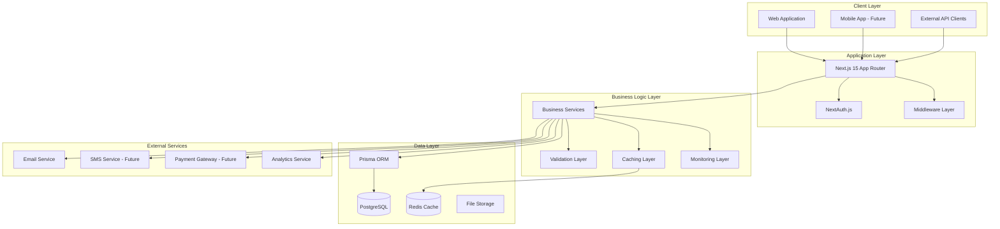
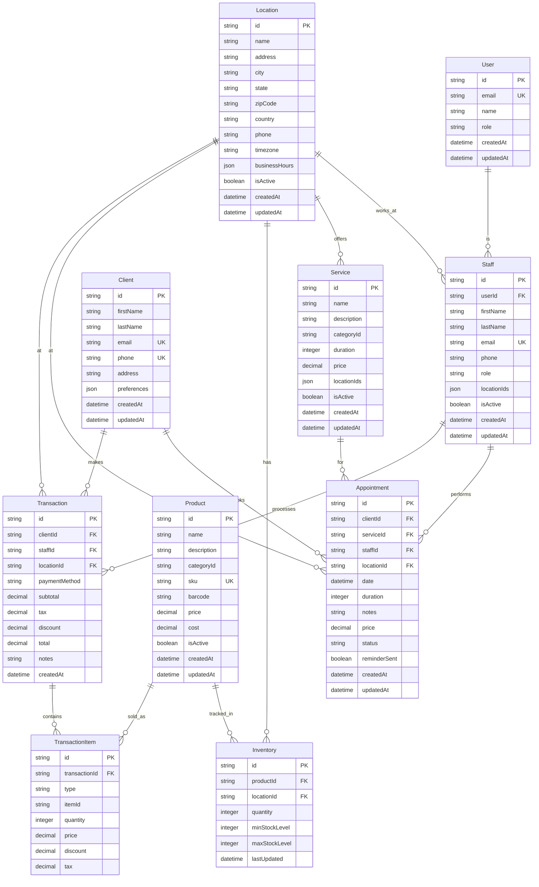
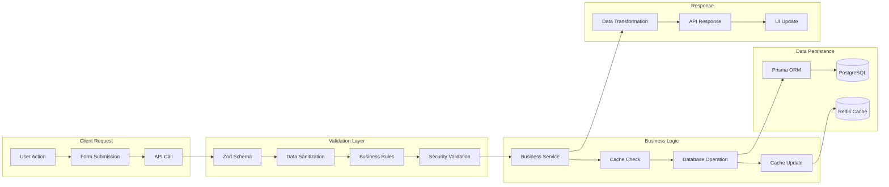
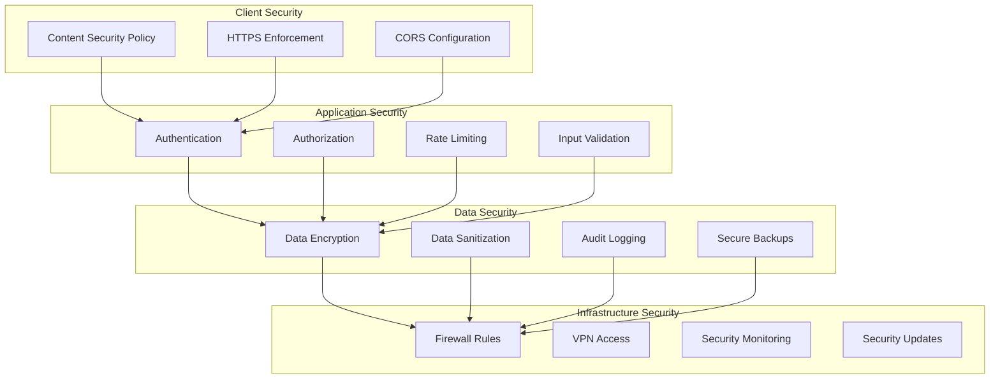
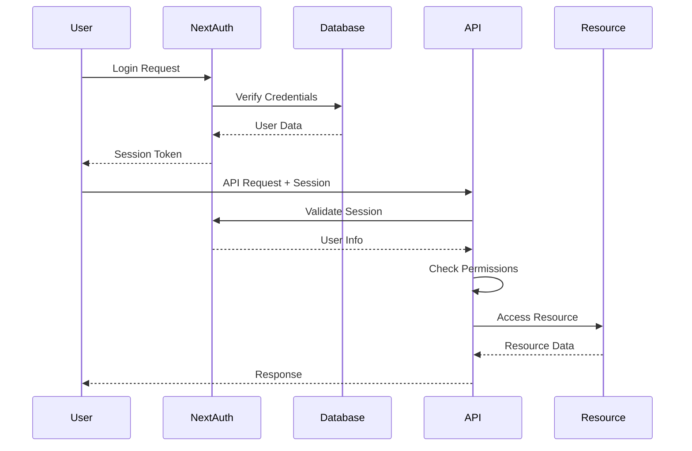
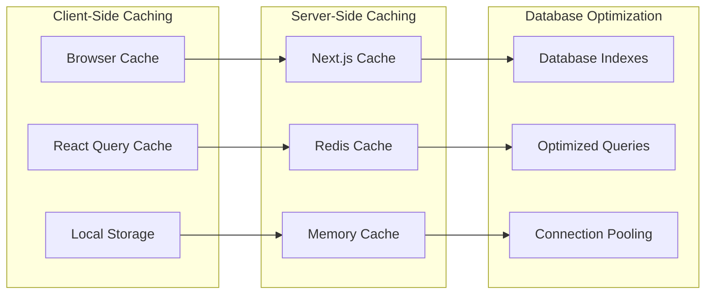
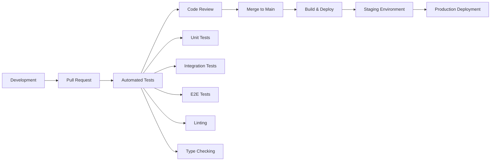

# Vanity Hub - Project Architecture

## 🎯 **Overview**

This document provides a comprehensive overview of Vanity Hub's architecture, including system design, technology stack, data flow, and architectural decisions. The system is designed for scalability, maintainability, and performance.

## 🏗️ **System Architecture**

### **High-Level Architecture**


### **Technology Stack**

#### **Frontend**
- **Framework**: Next.js 15 with App Router
- **Language**: TypeScript
- **Styling**: Tailwind CSS
- **UI Components**: shadcn/ui (Radix UI + Tailwind)
- **State Management**: React Context + Custom Hooks
- **Forms**: React Hook Form + Zod validation
- **Charts**: Recharts
- **Icons**: Lucide React

#### **Backend**
- **Runtime**: Node.js
- **Framework**: Next.js 15 API Routes
- **Language**: TypeScript
- **Authentication**: NextAuth.js
- **Database ORM**: Prisma
- **Validation**: Zod with custom validation layer
- **Caching**: Redis with fallback to memory
- **Rate Limiting**: Custom Redis-based implementation

#### **Database & Storage**
- **Primary Database**: PostgreSQL
- **Cache**: Redis
- **File Storage**: Local filesystem (Future: AWS S3/CloudFlare R2)
- **Search**: PostgreSQL full-text search (Future: Elasticsearch)

#### **DevOps & Monitoring**
- **Deployment**: Vercel (Production), Docker (Development)
- **Monitoring**: Custom monitoring service + Error tracking
- **Logging**: Custom logger with structured logging
- **Testing**: Jest + React Testing Library + Playwright
- **CI/CD**: GitHub Actions

## 📊 **Data Architecture**

### **Database Schema Overview**


### **Data Flow Architecture**


## 🔧 **Component Architecture**

### **Frontend Component Hierarchy**
```
App Layout
├── Navigation
│   ├── Main Navigation
│   ├── User Navigation
│   └── Mobile Navigation
├── Dashboard Layout
│   ├── Sidebar
│   ├── Header
│   └── Content Area
├── Feature Components
│   ├── Client Management
│   │   ├── Client List
│   │   ├── Client Form
│   │   ├── Client Details
│   │   └── Client Search
│   ├── Appointment Management
│   │   ├── Calendar View
│   │   ├── Appointment Form
│   │   ├── Appointment List
│   │   └── Scheduling Logic
│   ├── Service Management
│   │   ├── Service List
│   │   ├── Service Form
│   │   └── Service Categories
│   └── Inventory Management
│       ├── Inventory Dashboard
│       ├── Stock Management
│       ├── Transfer System
│       └── Analytics
├── Shared Components
│   ├── UI Components (shadcn/ui)
│   ├── Form Components
│   ├── Chart Components
│   ├── Modal Components
│   └── Loading Components
└── Providers
    ├── Auth Provider
    ├── Theme Provider
    ├── Location Provider
    └── Currency Provider
```

### **Backend Service Architecture**
```
API Layer
├── Route Handlers
│   ├── Authentication Routes
│   ├── Client Routes
│   ├── Appointment Routes
│   ├── Service Routes
│   ├── Staff Routes
│   ├── Inventory Routes
│   └── Analytics Routes
├── Middleware
│   ├── Authentication Middleware
│   ├── Rate Limiting Middleware
│   ├── Validation Middleware
│   └── Error Handling Middleware
├── Business Services
│   ├── Client Service
│   ├── Appointment Service
│   ├── Service Management
│   ├── Staff Service
│   ├── Inventory Service
│   └── Analytics Service
├── Data Access Layer
│   ├── Prisma Client
│   ├── Database Utilities
│   ├── Cache Service
│   └── Query Optimization
└── External Services
    ├── Email Service
    ├── SMS Service (Future)
    ├── Payment Service (Future)
    └── File Storage Service
```

## 🔒 **Security Architecture**

### **Security Layers**


### **Authentication & Authorization Flow**


## 📈 **Performance Architecture**

### **Caching Strategy**


### **Performance Monitoring**
- **Real User Monitoring**: Web Vitals tracking
- **Application Performance**: Response time monitoring
- **Database Performance**: Query performance tracking
- **Cache Performance**: Hit ratio monitoring
- **Error Tracking**: Comprehensive error logging

## 🔄 **Deployment Architecture**

### **Development Environment**
```
Local Development
├── Next.js Development Server
├── PostgreSQL (Docker)
├── Redis (Docker)
├── File Storage (Local)
└── Email Service (Mock)
```

### **Production Environment**
```
Production (Vercel)
├── Next.js Application
├── PostgreSQL (Managed)
├── Redis (Managed)
├── File Storage (CDN)
├── Email Service (SendGrid)
└── Monitoring (Custom)
```

### **CI/CD Pipeline**


## 📊 **Monitoring & Observability**

### **Monitoring Stack**
- **Application Monitoring**: Custom monitoring service
- **Error Tracking**: Custom error tracking with grouping
- **Performance Monitoring**: Response time and throughput tracking
- **Infrastructure Monitoring**: Server and database metrics
- **User Analytics**: User behavior and feature usage

### **Alerting Strategy**
- **Critical Alerts**: System down, database errors, security breaches
- **Warning Alerts**: High response times, low cache hit ratios, high error rates
- **Info Alerts**: Deployment notifications, scheduled maintenance

## 🔮 **Future Architecture Considerations**

### **Scalability Improvements**
- **Microservices**: Break down monolith into focused services
- **Event-Driven Architecture**: Implement event sourcing and CQRS
- **API Gateway**: Centralized API management and routing
- **Container Orchestration**: Kubernetes for container management

### **Technology Upgrades**
- **Database Sharding**: Horizontal database scaling
- **CDN Integration**: Global content delivery
- **Search Engine**: Elasticsearch for advanced search
- **Message Queue**: Redis Pub/Sub or RabbitMQ for async processing

### **Mobile Architecture**
- **React Native**: Cross-platform mobile application
- **API Optimization**: Mobile-specific API endpoints
- **Offline Support**: Local data synchronization
- **Push Notifications**: Real-time mobile notifications

---

**Last Updated**: 2025-06-27  
**Architecture Version**: v2.0  
**Next Review**: 2025-07-27
